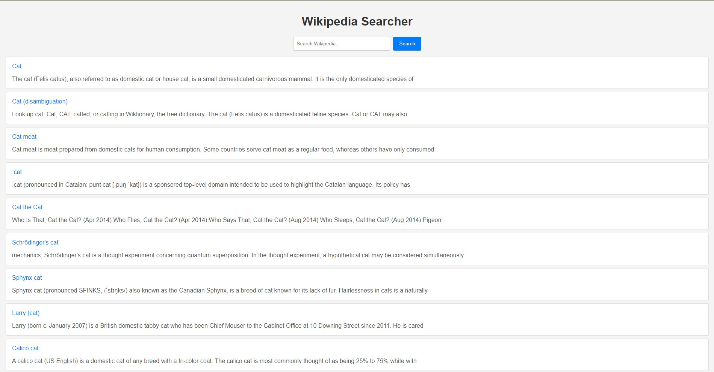

# Поисковик по Википедии на React + MobX

## Описание
Данное приложение реализует поисковик по Википедии, позволяя пользователям искать статьи и просматривать результаты. 
Пользователи могут вводить запросы в поле поиска и получать результаты, используя API Википедии.

## Использование

- **Поиск:** Введите текст запроса в поле поиска и нажмите клавишу Enter или кнопку "Поиск", чтобы получить результаты.
- **Просмотр результатов:** Результаты отображаются на странице, и вы можете кликнуть на любой из них для перехода на соответствующую страницу Википедии.

## Технологии

- **React:** Библиотека для создания пользовательских интерфейсов.
- **MobX:** Библиотека для управления состоянием приложения.
- **Axios:** Библиотека для выполнения HTTP-запросов.

## Скриншоты

